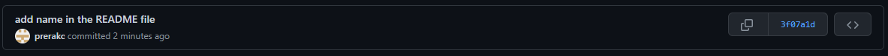
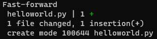
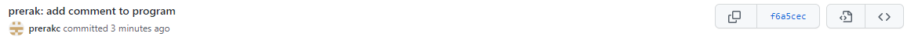

Prerak Chaudhari

**Activity 1**

**Activity 2**

**Activity 3**

**Activity 4**

Teammate's repo: https://github.com/esmatsahak/ECE444-F2022-Lab1

My commit:

Teammate's commit:

**Activity 5**

Commands run: 
1) git checkout rebase 
2) git rebase develop
3) git checkout develop
4) git rebase rebase

Commit history of develop branch:

**Activity 6**

https://github.com/prerakc/ECE444-F2022-EP

**Activity 7**

Rebase Command:

**Activity 8**

Rebase Command:
